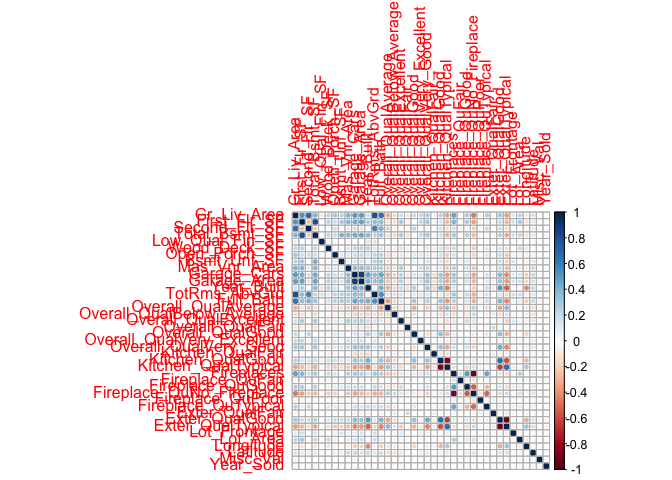
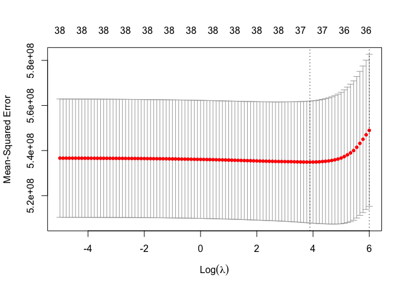

DSII_HW1_co2554
================
Camille Okonkwo
2024-02-23

## loading training and testing data

``` r
testing_data = read_csv("data/housing_test.csv")
```

    ## Rows: 959 Columns: 26
    ## ── Column specification ────────────────────────────────────────────────────────
    ## Delimiter: ","
    ## chr  (4): Overall_Qual, Kitchen_Qual, Fireplace_Qu, Exter_Qual
    ## dbl (22): Gr_Liv_Area, First_Flr_SF, Second_Flr_SF, Total_Bsmt_SF, Low_Qual_...
    ## 
    ## ℹ Use `spec()` to retrieve the full column specification for this data.
    ## ℹ Specify the column types or set `show_col_types = FALSE` to quiet this message.

``` r
training_data = read_csv("data/housing_training.csv")
```

    ## Rows: 1440 Columns: 26
    ## ── Column specification ────────────────────────────────────────────────────────
    ## Delimiter: ","
    ## chr  (4): Overall_Qual, Kitchen_Qual, Fireplace_Qu, Exter_Qual
    ## dbl (22): Gr_Liv_Area, First_Flr_SF, Second_Flr_SF, Total_Bsmt_SF, Low_Qual_...
    ## 
    ## ℹ Use `spec()` to retrieve the full column specification for this data.
    ## ℹ Specify the column types or set `show_col_types = FALSE` to quiet this message.

1a) Fit a lasso model on the training data. Report the selected tuning
parameter and the test error. When the 1SE rule is applied, how many
predictors are included in the model?

### loading `glmnet`

``` r
library(glmnet)
```

    ## Loading required package: Matrix

    ## 
    ## Attaching package: 'Matrix'

    ## The following objects are masked from 'package:tidyr':
    ## 
    ##     expand, pack, unpack

    ## Loaded glmnet 4.1-8

### specifying predictors and response variables

``` r
x <- model.matrix(Sale_Price ~ ., training_data)[,-1]
y <- as.numeric(training_data$Sale_Price)

library(corrplot)
```

    ## corrplot 0.92 loaded

``` r
corrplot(cor(x), method = "circle", type = "full")
```

<!-- -->

### fitting lasso model on the training data

``` r
set.seed(2)

cv.lasso <- cv.glmnet(x, 
                      y,
                      alpha = 1,
                      lambda = exp(seq(6, -5, length = 100)))

plot(cv.lasso)
```

<!-- -->

### selected tuning parameter and test error

``` r
# tuning parameter
cv.lasso$lambda.min
```

    ## [1] 48.85657

``` r
# test error
min(cv.lasso$cvm)
```

    ## [1] 534903510

The best tuning parameter selected for the lasso model is an alpha = 1
and a lambda = 48.857. The test error is 534903510.

### applying 1SE

``` r
# 1SE lambda
cv.lasso$lambda.1se
```

    ## [1] 403.4288

``` r
# extracting coefficients
lasso.1se <- predict(cv.lasso, s = cv.lasso$lambda.1se, type = "coefficients")

# counting how many predictors included in model
num_predictors_1se <- sum(lasso.1se != 0)
```

When the 1SE rule is applied, there are 37 predictors included in the
model.

1b) Fit an elastic net model on the training data. Report the selected
tuning parameters and the test error. Is it possible to apply the 1SE
rule to select the tuning parameters for elastic net? If the 1SE rule is
applicable, implement it to select the tuning parameters. If not,
explain why. loading `caret`

``` r
library(caret)
```

    ## Loading required package: lattice

    ## 
    ## Attaching package: 'caret'

    ## The following object is masked from 'package:purrr':
    ## 
    ##     lift

### fitting an elastic net model on the training data

``` r
# creating a training control with a 10-fold cross-validation
ctrl1 <- trainControl(method = "cv", number = 10)

set.seed(2)

# elastic net model
enet.fit <- train(Sale_Price ~ .,
                  data = training_data,
                  method = "glmnet",
                  tuneGrid = expand.grid(alpha = seq(0, 1, length = 21),
                                         lambda = exp(seq(6, 0, length = 100))),
                  trControl = ctrl1)
```

### selected tuning parameter and test error

``` r
# tuning parameter
enet.fit$bestTune
```

    ##     alpha   lambda
    ## 394  0.15 280.4411

``` r
# prediction
enet.pred <- predict(enet.fit, newdata = testing_data)

# test error
mean((enet.pred - testing_data$Sale_Price)^2)
```

    ## [1] 440114202

The best tuning parameter selected for the elastic net model is an alpha
= 0.1 and a lambda = 403.4288. The test error is 439135085.

The 1SE rule is not applicable in selecting the tuning parameters for
elastic net. Since elastic net is a combination of lasso and ridge, it
over-complicates the model. Lasso and ridge have one tuning parameter,
while elastic net has two.

1c) Fit a partial least squares model on the training data and report
the test error. How many components are included in your model?

### PLS using `caret`

``` r
set.seed(2)

ctrl1 <- trainControl(method = "repeatedcv",
                      number = 10,
                      repeats = 5,
                      selectionFunction = "best")

pls.fit <- train(x, y,
                 method = "pls",
                 tuneGrid = data.frame(ncomp = 1:19),
                 trControl = ctrl1,
                 preProcess = c("center", "scale"))
```

1d) Choose the best model for predicting the response and explain your
choice.

1e) If “caret” was used for the elastic net in (b), retrain this model
with “tidymodels”, and vice versa. Compare the selected tuning
parameters between the two software approaches. Should there be
discrepancies in the chosen parameters, discuss potential reasons for
these differences.
