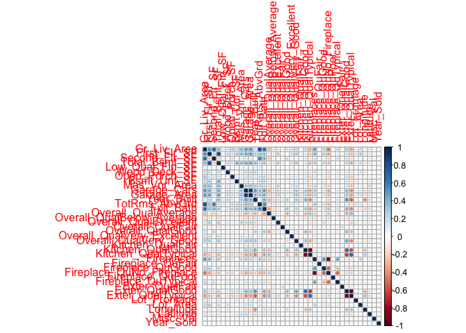
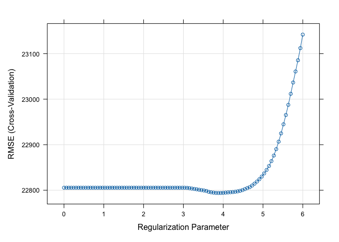
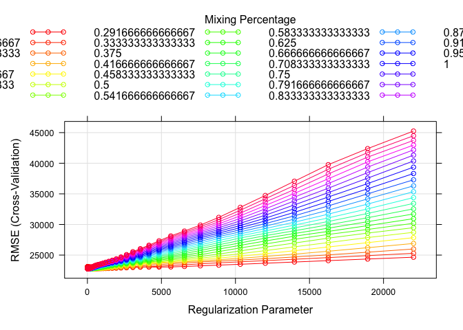
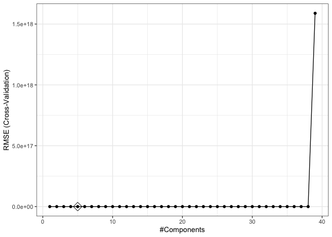
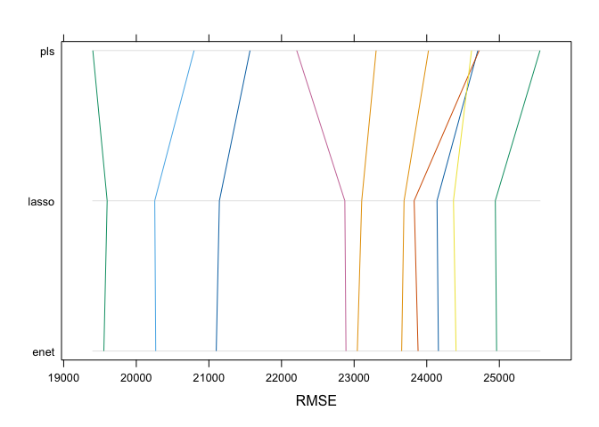
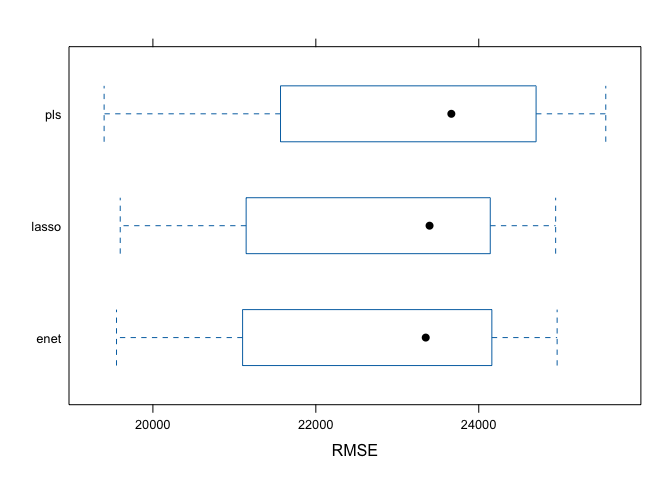
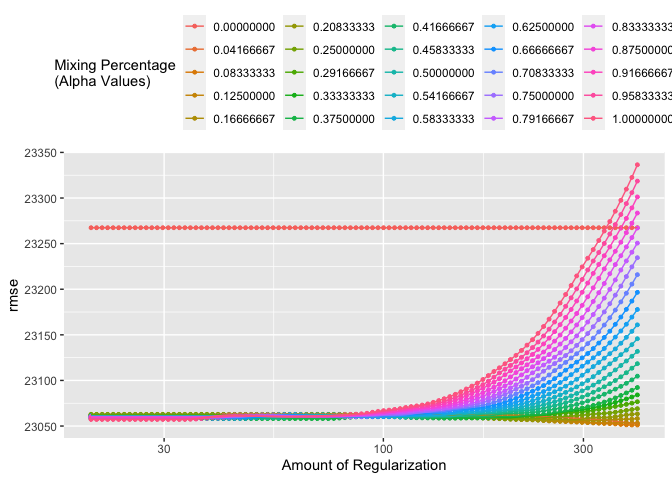

DSII HW1 co2554
================
Camille Okonkwo
2024-02-23

### loading training and testing data

``` r
testing_data = read_csv("data/housing_test.csv")
```

    ## Rows: 959 Columns: 26
    ## ── Column specification ────────────────────────────────────────────────────────
    ## Delimiter: ","
    ## chr  (4): Overall_Qual, Kitchen_Qual, Fireplace_Qu, Exter_Qual
    ## dbl (22): Gr_Liv_Area, First_Flr_SF, Second_Flr_SF, Total_Bsmt_SF, Low_Qual_...
    ## 
    ## ℹ Use `spec()` to retrieve the full column specification for this data.
    ## ℹ Specify the column types or set `show_col_types = FALSE` to quiet this message.

``` r
training_data = read_csv("data/housing_training.csv")
```

    ## Rows: 1440 Columns: 26
    ## ── Column specification ────────────────────────────────────────────────────────
    ## Delimiter: ","
    ## chr  (4): Overall_Qual, Kitchen_Qual, Fireplace_Qu, Exter_Qual
    ## dbl (22): Gr_Liv_Area, First_Flr_SF, Second_Flr_SF, Total_Bsmt_SF, Low_Qual_...
    ## 
    ## ℹ Use `spec()` to retrieve the full column specification for this data.
    ## ℹ Specify the column types or set `show_col_types = FALSE` to quiet this message.

### specifying predictors and response variables

``` r
# training data
x <- model.matrix(Sale_Price ~ ., training_data)[, -1]
y <- training_data$Sale_Price

# testing data
x2 <- model.matrix(Sale_Price ~ .,testing_data)[, -1]
y2 <- testing_data$Sale_Price

# correlation plot
library(corrplot)
```

    ## corrplot 0.92 loaded

``` r
corrplot(cor(x), method = "circle", type = "full")
```

<!-- -->

1a) Fit a lasso model on the training data. Report the selected tuning
parameter and the test error. When the 1SE rule is applied, how many
predictors are included in the model?

### fitting lasso model on the training data using `caret`

``` r
library(caret)
```

    ## Loading required package: lattice

    ## 
    ## Attaching package: 'caret'

    ## The following object is masked from 'package:purrr':
    ## 
    ##     lift

``` r
# creating a training control with a 10-fold cross-validation
ctrl1 <- trainControl(method = "cv", 
                      number = 10, 
                      selectionFunction = "best")

set.seed(2)

# fitting lasso model
lasso.fit <- train(Sale_Price ~.,
                   data = training_data,
                   method = "glmnet",
                   tuneGrid = expand.grid(alpha = 1,
                                          lambda = exp(seq(6, 0, length = 100))),
                   trControl = ctrl1
)

plot(lasso.fit, xTrans = log)
```

<!-- -->

``` r
# tuning parameter
lasso.fit$bestTune
```

    ##    alpha   lambda
    ## 65     1 48.36555

``` r
# prediction
lasso.pred <- predict(lasso.fit, newdata = testing_data)

# test error
mean((lasso.pred - testing_data$Sale_Price)^2)
```

    ## [1] 441688534

The best tuning parameter selected for the lasso model using the 1SE
rule is a lambda = 48.3655546. The test error is 4.4168853^{8}.

### applying 1SE

``` r
# creating a training control with a 10-fold cross-validation using 1se criteria
ctrl2 <- trainControl(method = "cv", 
                      number = 10, 
                      selectionFunction = "oneSE")

set.seed(2)

# 1SE lasso
lasso.1se <- train(Sale_Price ~.,
                   data = training_data,
                   method = "glmnet",
                   tuneGrid = expand.grid(alpha = 1,
                                          lambda = exp(seq(6, 0, length = 100))),
                   trControl = ctrl2
)

plot(lasso.1se, xTrans = log)
```

<!-- -->

``` r
# extracting coefficients in the 1se model
coef(lasso.1se$finalModel, lasso.1se$bestTune$lambda)
```

    ## 40 x 1 sparse Matrix of class "dgCMatrix"
    ##                                       s1
    ## (Intercept)                -3.919159e+06
    ## Gr_Liv_Area                 6.099153e+01
    ## First_Flr_SF                9.477449e-01
    ## Second_Flr_SF               .           
    ## Total_Bsmt_SF               3.627699e+01
    ## Low_Qual_Fin_SF            -3.523480e+01
    ## Wood_Deck_SF                1.000632e+01
    ## Open_Porch_SF               1.203918e+01
    ## Bsmt_Unf_SF                -2.059528e+01
    ## Mas_Vnr_Area                1.297320e+01
    ## Garage_Cars                 3.491107e+03
    ## Garage_Area                 9.740129e+00
    ## Year_Built                  3.150805e+02
    ## TotRms_AbvGrd              -2.518326e+03
    ## Full_Bath                  -1.415647e+03
    ## Overall_QualAverage        -4.006722e+03
    ## Overall_QualBelow_Average  -1.084480e+04
    ## Overall_QualExcellent       8.719850e+04
    ## Overall_QualFair           -8.763236e+03
    ## Overall_QualGood            1.111389e+04
    ## Overall_QualVery_Excellent  1.559964e+05
    ## Overall_QualVery_Good       3.730815e+04
    ## Kitchen_QualFair           -1.420320e+04
    ## Kitchen_QualGood           -7.639239e+03
    ## Kitchen_QualTypical        -1.644274e+04
    ## Fireplaces                  8.190689e+03
    ## Fireplace_QuFair           -3.809974e+03
    ## Fireplace_QuGood            2.196176e+03
    ## Fireplace_QuNo_Fireplace    .           
    ## Fireplace_QuPoor           -1.484163e+03
    ## Fireplace_QuTypical        -4.125304e+03
    ## Exter_QualFair             -1.695505e+04
    ## Exter_QualGood              .           
    ## Exter_QualTypical          -4.790664e+03
    ## Lot_Frontage                8.663344e+01
    ## Lot_Area                    5.915806e-01
    ## Longitude                  -2.246220e+04
    ## Latitude                    3.767830e+04
    ## Misc_Val                    3.093854e-01
    ## Year_Sold                  -1.654627e+02

When the 1SE rule is applied, there are 37 predictors included in the
model.

1b) Fit an elastic net model on the training data. Report the selected
tuning parameters and the test error. Is it possible to apply the 1SE
rule to select the tuning parameters for elastic net? If the 1SE rule is
applicable, implement it to select the tuning parameters. If not,
explain why.

### fitting an elastic net model on the training data using `caret`

``` r
set.seed(2)

# elastic net model
enet.fit <- train(Sale_Price ~ .,
                  data = training_data,
                  method = "glmnet",
                  tuneGrid = expand.grid(alpha = seq(0, 1, length = 25),
                                         lambda = exp(seq(10, -5, length = 100))),
                  trControl = ctrl1)
# CV plot
myCol <- rainbow(25)
myPar <- list(superpose.symbol = list(col = myCol),
              superpose.line = list(col = myCol)) 

plot(enet.fit, par.settings = myPar)
```

<!-- -->

``` r
# tuning parameter
enet.fit$bestTune
```

    ##     alpha   lambda
    ## 372 0.125 316.5799

``` r
# prediction
enet.pred <- predict(enet.fit, newdata = testing_data)

# test error
mean((enet.pred - testing_data$Sale_Price)^2)
```

    ## [1] 439958922

The best tuning parameter selected for the elastic net model is an alpha
= 0.125 and a lambda = `enet.fit$bestTune$lambda`. The test error is
4.3995892^{8}.

### applying 1SE rule to elastic net model in `caret`

``` r
set.seed(2)

# 1SE cross validation
ctrl2 <- trainControl(method = "cv",
                      number = 10,
                      selectionFunction = "oneSE")
# elastic net model
enet.fit.1se <- train(Sale_Price ~ .,
                  data = training_data,
                  method = "glmnet",
                  tuneGrid = expand.grid(alpha = seq(0, 1, length = 25),
                                         lambda = exp(seq(10, -5, length = 100))),
                  trControl = ctrl2)

# tuning parameter
enet.fit.1se$bestTune
```

    ##    alpha  lambda
    ## 94     0 8874.25

``` r
enet.fit.1se$bestTune$lambda
```

    ## [1] 8874.25

``` r
# prediction
enet.pred.1se <- predict(enet.fit.1se, newdata = testing_data)

# test error
mean((enet.pred.1se - testing_data$Sale_Price)^2)
```

    ## [1] 429008445

The best tuning parameter selected for the elastic net model using 1SE
is an alpha = 0 and a lambda = `enet.fit.1se$bestTune$lambda`. The test
error is 4.2900844^{8}. An alpha value of zero signifies pure ridge
regression, and instead of the mix of L1 and L2 regularization we see in
elastic net, it becomes only L2 and the penalty term for the L1
normalization is removed from the optimization objective. That being
said, 1SE is not applicable in this case to elastic net.

1c) Fit a partial least squares model on the training data and report
the test error. How many components are included in your model?

### PLS using `caret`

``` r
set.seed(2)
# model look up

modelLookup("pls")
```

    ##   model parameter       label forReg forClass probModel
    ## 1   pls     ncomp #Components   TRUE     TRUE      TRUE

``` r
# partial least squares model
pls.fit <- train(x, 
                 y,
                 method = "pls",
                 tuneGrid = data.frame(ncomp = 1:39),
                 trControl = ctrl2,
                 preProcess = c("center", "scale"))

# predict
predy2.pls2 <- predict(pls.fit, newdata = x2)

# components
pls.fit$bestTune$ncomp
```

    ## [1] 5

``` r
# test error
mean((y2 - predy2.pls2)^2)
```

    ## [1] 433847486

``` r
# components plot
ggplot(pls.fit, highlight = TRUE) + theme_bw()
```

<!-- --> From the
components plot, we see there are 5 components chosen for this model.
The test error is 4.3384749^{8}.

1d) Choose the best model for predicting the response and explain your
choice.

### comparing models

``` r
set.seed(2)

resamp <- resamples(list(enet = enet.fit, lasso = lasso.fit, pls = pls.fit))

summary(resamp)
```

    ## 
    ## Call:
    ## summary.resamples(object = resamp)
    ## 
    ## Models: enet, lasso, pls 
    ## Number of resamples: 10 
    ## 
    ## MAE 
    ##           Min.  1st Qu.   Median     Mean  3rd Qu.     Max. NA's
    ## enet  14475.78 15704.80 16574.32 16576.93 17526.38 18435.93    0
    ## lasso 14524.52 15733.97 16600.29 16597.58 17545.81 18444.32    0
    ## pls   14255.52 16008.64 16826.35 16670.16 17577.15 18312.42    0
    ## 
    ## RMSE 
    ##           Min.  1st Qu.   Median     Mean  3rd Qu.     Max. NA's
    ## enet  19553.24 21547.70 23349.14 22791.47 24090.69 24962.09    0
    ## lasso 19598.86 21576.32 23396.09 22793.95 24062.41 24943.84    0
    ## pls   19401.16 21727.09 23663.51 23090.13 24681.99 25559.15    0
    ## 
    ## Rsquared 
    ##            Min.   1st Qu.    Median      Mean   3rd Qu.      Max. NA's
    ## enet  0.8739785 0.8879224 0.9062167 0.9039434 0.9193917 0.9264356    0
    ## lasso 0.8736728 0.8881479 0.9058904 0.9039037 0.9195208 0.9265658    0
    ## pls   0.8696113 0.8843458 0.9028424 0.9014074 0.9203902 0.9260354    0

``` r
parallelplot(resamp, metric = "RMSE")
```

<!-- -->

``` r
bwplot(resamp, metric = "RMSE")
```

<!-- --> From the
resampling summary, I believe the best model is the elastic net since it
has the smallest mean RMSE value. If you wish to use the median RMSE
value, the best model is the lasso since it has the smallest median
RMSE.

1e) If “caret” was used for the elastic net in (b), retrain this model
with “tidymodels”, and vice versa. Compare the selected tuning
parameters between the two software approaches. Should there be
discrepancies in the chosen parameters, discuss potential reasons for
these differences.

### retraining elastic net with `tidymodels`

``` r
library(tidymodels)
```

    ## ── Attaching packages ────────────────────────────────────── tidymodels 1.1.1 ──

    ## ✔ broom        1.0.5     ✔ rsample      1.2.0
    ## ✔ dials        1.2.0     ✔ tune         1.1.2
    ## ✔ infer        1.0.6     ✔ workflows    1.1.3
    ## ✔ modeldata    1.3.0     ✔ workflowsets 1.0.1
    ## ✔ parsnip      1.1.1     ✔ yardstick    1.3.0
    ## ✔ recipes      1.0.9

    ## ── Conflicts ───────────────────────────────────────── tidymodels_conflicts() ──
    ## ✖ scales::discard()        masks purrr::discard()
    ## ✖ dplyr::filter()          masks stats::filter()
    ## ✖ recipes::fixed()         masks stringr::fixed()
    ## ✖ dplyr::lag()             masks stats::lag()
    ## ✖ caret::lift()            masks purrr::lift()
    ## ✖ yardstick::precision()   masks caret::precision()
    ## ✖ yardstick::recall()      masks caret::recall()
    ## ✖ yardstick::sensitivity() masks caret::sensitivity()
    ## ✖ yardstick::spec()        masks readr::spec()
    ## ✖ yardstick::specificity() masks caret::specificity()
    ## ✖ recipes::step()          masks stats::step()
    ## • Search for functions across packages at https://www.tidymodels.org/find/

``` r
set.seed(2)

cv_folds <- vfold_cv(training_data, v = 10)

# model specification for elastic net
enet_spec <- linear_reg(penalty = tune(), mixture = tune()) |>
  set_engine("glmnet") |>
  set_mode("regression")

# grid of tuning parameters
enet_grid_set <- parameters(penalty(range = c(3, 6),
                                    trans = log_trans()),
                            mixture(range = c(0, 1)))

enet_grid <- grid_regular(enet_grid_set, levels = c(100, 25))

# set up workflow
enet_workflow <- workflow() |>
  add_model(enet_spec) |>
  add_formula(Sale_Price ~ .)

set.seed(2)

# tuning model
enet_tune <- tune_grid(
  enet_workflow,
  resamples = cv_folds,
  grid = enet_grid
)

# CV plot
autoplot(enet_tune, metric = "rmse") + 
  theme(legend.position = "top") +
  labs(color = "Mixing Percentage\n(Alpha Values)") 
```

<!-- -->

``` r
# selecting best tuning parameters
enet_best <- select_best(enet_tune, metric = "rmse")

print(enet_best)
```

    ## # A tibble: 1 × 3
    ##   penalty mixture .config                
    ##     <dbl>   <dbl> <chr>                  
    ## 1    403.  0.0833 Preprocessor1_Model0300

``` r
enet_best$mixture
```

    ## [1] 0.08333333

``` r
# update model with the best lambda
final_enet_spec <- enet_spec |> 
  update(penalty = enet_best$penalty,
         mixture = enet_best$mixture)

# fit model to the train data
enet_fit <- fit(final_enet_spec,
                formula = Sale_Price ~ .,
                data = training_data)

# extract coefficients
enet_model <- extract_fit_engine(enet_fit)

coef(enet_model, s = enet_best$penalty)
```

    ## 40 x 1 sparse Matrix of class "dgCMatrix"
    ##                                       s1
    ## (Intercept)                -5.040585e+06
    ## Gr_Liv_Area                 4.032808e+01
    ## First_Flr_SF                2.546297e+01
    ## Second_Flr_SF               2.433435e+01
    ## Total_Bsmt_SF               3.506300e+01
    ## Low_Qual_Fin_SF            -1.692490e+01
    ## Wood_Deck_SF                1.214898e+01
    ## Open_Porch_SF               1.652181e+01
    ## Bsmt_Unf_SF                -2.078557e+01
    ## Mas_Vnr_Area                1.136886e+01
    ## Garage_Cars                 4.071919e+03
    ## Garage_Area                 8.625455e+00
    ## Year_Built                  3.206475e+02
    ## TotRms_AbvGrd              -3.515674e+03
    ## Full_Bath                  -3.786643e+03
    ## Overall_QualAverage        -5.058433e+03
    ## Overall_QualBelow_Average  -1.267453e+04
    ## Overall_QualExcellent       7.554019e+04
    ## Overall_QualFair           -1.130357e+04
    ## Overall_QualGood            1.205285e+04
    ## Overall_QualVery_Excellent  1.357631e+05
    ## Overall_QualVery_Good       3.776592e+04
    ## Kitchen_QualFair           -2.414575e+04
    ## Kitchen_QualGood           -1.653562e+04
    ## Kitchen_QualTypical        -2.459229e+04
    ## Fireplaces                  1.083691e+04
    ## Fireplace_QuFair           -7.892985e+03
    ## Fireplace_QuGood            1.950701e+01
    ## Fireplace_QuNo_Fireplace    1.779618e+03
    ## Fireplace_QuPoor           -5.843473e+03
    ## Fireplace_QuTypical        -7.056254e+03
    ## Exter_QualFair             -3.353408e+04
    ## Exter_QualGood             -1.515524e+04
    ## Exter_QualTypical          -1.968853e+04
    ## Lot_Frontage                1.002773e+02
    ## Lot_Area                    6.035970e-01
    ## Longitude                  -3.462259e+04
    ## Latitude                    5.738066e+04
    ## Misc_Val                    8.646105e-01
    ## Year_Sold                  -5.788518e+02

``` r
# prediction
enet_pred <- predict(enet_fit, new_data = testing_data)

# test RMSE
sqrt(mean((enet_pred[[1]] - testing_data$Sale_Price)^2))
```

    ## [1] 20968.2

Using `tidymodels` the alpha 0.0833333 and the penalty (lambda) is
403.4287935. Using caret, the alpha is 0 and the lambda is
`enet.fit.1se$bestTune$lambda`. These are likely different because
different packages use different compilation methods.
