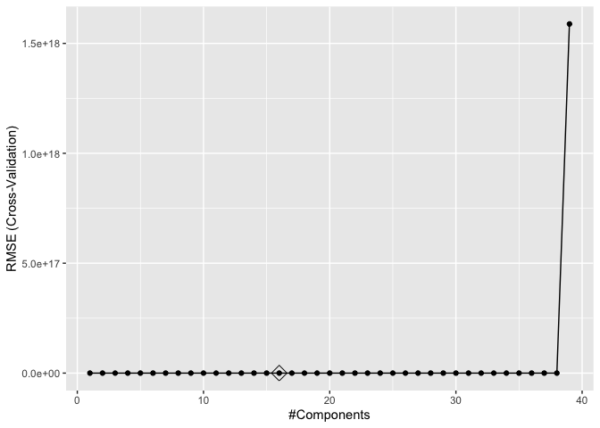
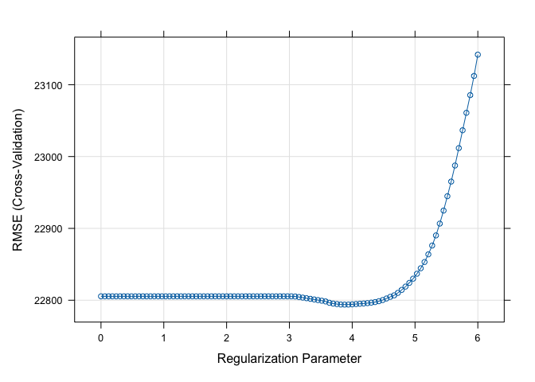
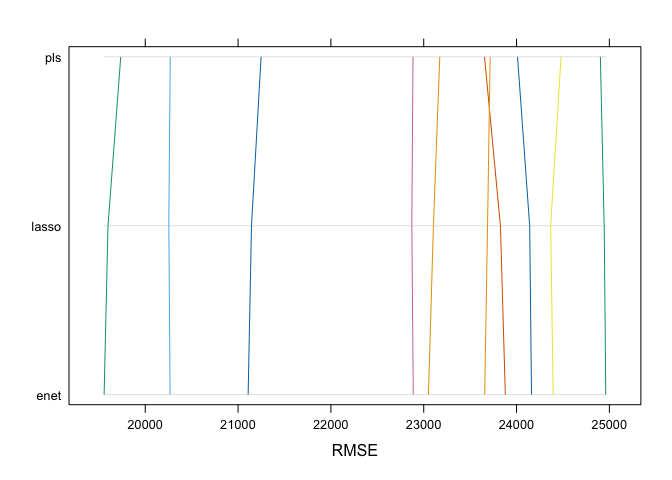
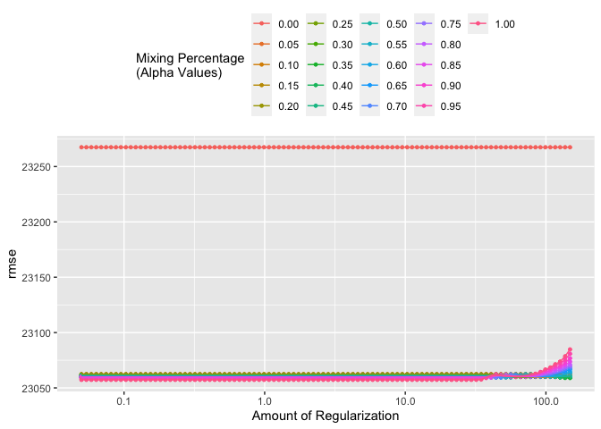

DSII_HW1_co2554
================
Camille Okonkwo
2024-02-23

### loading training and testing data

``` r
testing_data = read_csv("data/housing_test.csv")
```

    ## Rows: 959 Columns: 26
    ## ── Column specification ────────────────────────────────────────────────────────
    ## Delimiter: ","
    ## chr  (4): Overall_Qual, Kitchen_Qual, Fireplace_Qu, Exter_Qual
    ## dbl (22): Gr_Liv_Area, First_Flr_SF, Second_Flr_SF, Total_Bsmt_SF, Low_Qual_...
    ## 
    ## ℹ Use `spec()` to retrieve the full column specification for this data.
    ## ℹ Specify the column types or set `show_col_types = FALSE` to quiet this message.

``` r
training_data = read_csv("data/housing_training.csv")
```

    ## Rows: 1440 Columns: 26
    ## ── Column specification ────────────────────────────────────────────────────────
    ## Delimiter: ","
    ## chr  (4): Overall_Qual, Kitchen_Qual, Fireplace_Qu, Exter_Qual
    ## dbl (22): Gr_Liv_Area, First_Flr_SF, Second_Flr_SF, Total_Bsmt_SF, Low_Qual_...
    ## 
    ## ℹ Use `spec()` to retrieve the full column specification for this data.
    ## ℹ Specify the column types or set `show_col_types = FALSE` to quiet this message.

### specifying predictors and response variables

``` r
# training data
x <- model.matrix(Sale_Price ~ ., training_data)[, -1]
y <- training_data$Sale_Price

# testing data
x2 <- model.matrix(Sale_Price ~ .,testing_data)[, -1]
y2 <- testing_data$Sale_Price

# correlation plot
library(corrplot)
```

    ## corrplot 0.92 loaded

``` r
corrplot(cor(x), method = "circle", type = "full")
```

<!-- -->

### setting seed

``` r
set.seed(2)
```

1a) Fit a lasso model on the training data. Report the selected tuning
parameter and the test error. When the 1SE rule is applied, how many
predictors are included in the model?

### fitting lasso model on the training data using `glmnet`

``` r
library(glmnet)
```

    ## Loading required package: Matrix

    ## 
    ## Attaching package: 'Matrix'

    ## The following objects are masked from 'package:tidyr':
    ## 
    ##     expand, pack, unpack

    ## Loaded glmnet 4.1-8

``` r
set.seed(2)

cv.lasso <- cv.glmnet(x, 
                      y,
                      alpha = 1,
                      lambda = exp(seq(6, -5, length = 100)))

plot(cv.lasso)
```

<!-- -->

### selected tuning parameter and test error

``` r
# tuning parameter
cv.lasso$lambda.min
```

    ## [1] 48.85657

``` r
# test error
min(cv.lasso$cvm)
```

    ## [1] 534903510

The best tuning parameter selected for the lasso model is an alpha = 1
and a lambda = 48.857. The test error is 534903510.

### applying 1SE

``` r
# 1SE lambda
cv.lasso$lambda.1se
```

    ## [1] 403.4288

``` r
# extracting coefficients
lasso.1se <- predict(cv.lasso, s = cv.lasso$lambda.1se, type = "coefficients")

# counting how many predictors included in model
num_predictors_1se <- sum(lasso.1se != 0)
```

When the 1SE rule is applied, there are 37 predictors included in the
model.

1b) Fit an elastic net model on the training data. Report the selected
tuning parameters and the test error. Is it possible to apply the 1SE
rule to select the tuning parameters for elastic net? If the 1SE rule is
applicable, implement it to select the tuning parameters. If not,
explain why.

loading `caret`

``` r
library(caret)
```

    ## Loading required package: lattice

    ## 
    ## Attaching package: 'caret'

    ## The following object is masked from 'package:purrr':
    ## 
    ##     lift

### fitting an elastic net model on the training data

``` r
set.seed(2)

# creating a training control with a 10-fold cross-validation
ctrl1 <- trainControl(method = "cv", 
                      number = 10, 
                      selectionFunction = "best")

# elastic net model
enet.fit <- train(Sale_Price ~ .,
                  data = training_data,
                  method = "glmnet",
                  tuneGrid = expand.grid(alpha = seq(0, 1, length = 21),
                                         lambda = exp(seq(6, 0, length = 100))),
                  trControl = ctrl1)
```

### selected tuning parameter and test error

``` r
# tuning parameter
enet.fit$bestTune
```

    ##     alpha   lambda
    ## 394  0.15 280.4411

``` r
# prediction
enet.pred <- predict(enet.fit, newdata = testing_data)

# test error
mean((enet.pred - testing_data$Sale_Price)^2)
```

    ## [1] 440114202

The best tuning parameter selected for the elastic net model is an alpha
= 0.1 and a lambda = 403.4288. The test error is 440789346.

### applying 1SE to elastic net model in `caret`

``` r
set.seed(2)

# 1SE
ctrl2 <- trainControl(method = "cv",
                      number = 10,
                      selectionFunction = "oneSE")
# elastic net model
enet.fit.1se <- train(Sale_Price ~ .,
                  data = training_data,
                  method = "glmnet",
                  tuneGrid = expand.grid(alpha = seq(0, 1, length = 21),
                                         lambda = exp(seq(6, 0, length = 100))),
                  trControl = ctrl2)

# tuning parameter
enet.fit.1se$bestTune
```

    ##     alpha   lambda
    ## 100     0 403.4288

``` r
# prediction
enet.pred.1se <- predict(enet.fit.1se, newdata = testing_data)

# test error
mean((enet.pred.1se - testing_data$Sale_Price)^2)
```

    ## [1] 426357707

The best tuning parameter selected for the elastic net model using 1SE
is an alpha = 0 and a lambda = 403.4288. The test error is 440789346. An
alpha value of zero signifies pure ridge regression, and instead of the
mix of L1 and L2 regularization we see in elastic net, it becomes only
L2 and the penalty term for the L1 normalization is removed from the
optimization objective. That being said, 1SE is not applicable in this
case to elastic net.

1c) Fit a partial least squares model on the training data and report
the test error. How many components are included in your model?

### PLS using `caret`

``` r
set.seed(2)

library(caret)

#PLS
pls.fit <- train(x, 
                 y,
                 method = "pls",
                 tuneGrid = data.frame(ncomp = 1:39),
                 trControl = ctrl1,
                 preProcess = c("center", "scale"))


# test error
predy2.pls2 <- predict(pls.fit, newdata = x2)
mean((y2 - predy2.pls2)^2)
```

    ## [1] 446775692

``` r
# components plot
ggplot(pls.fit, highlight = TRUE)
```

<!-- --> There
are 8 components chosen for this model. The test error is 440217938.

1d) Choose the best model for predicting the response and explain your
choice.

### lasso using `caret`

``` r
set.seed(2)

# fitting lasso model
lasso.fit <- train(Sale_Price ~.,
                   data = training_data,
                   method = "glmnet",
                   tuneGrid = expand.grid(alpha = 1,
                                          lambda = exp(seq(6, 0, length = 100))),
                   trControl = ctrl1
)

plot(lasso.fit, xTrans = log)
```

<!-- -->

### comparing models

``` r
set.seed(2)

lm.fit <- train(Sale_Price ~ .,
                data = training_data,
                method = "lm",
                trControl = ctrl1)

resamp <- resamples(list(enet = enet.fit, lasso = lasso.fit, pls = pls.fit))

summary(resamp)
```

    ## 
    ## Call:
    ## summary.resamples(object = resamp)
    ## 
    ## Models: enet, lasso, pls 
    ## Number of resamples: 10 
    ## 
    ## MAE 
    ##           Min.  1st Qu.   Median     Mean  3rd Qu.     Max. NA's
    ## enet  14480.45 15705.42 16577.25 16579.63 17527.89 18436.52    0
    ## lasso 14524.52 15733.97 16600.29 16597.58 17545.81 18444.32    0
    ## pls   14585.07 15807.81 16639.83 16629.39 17570.18 18442.95    0
    ## 
    ## RMSE 
    ##           Min.  1st Qu.   Median     Mean  3rd Qu.     Max. NA's
    ## enet  19557.01 21553.16 23353.93 22792.39 24090.57 24961.13    0
    ## lasso 19598.86 21576.32 23396.09 22793.95 24062.41 24943.84    0
    ## pls   19736.20 21657.28 23413.90 22807.42 23936.71 24902.72    0
    ## 
    ## Rsquared 
    ##            Min.   1st Qu.    Median      Mean   3rd Qu.      Max. NA's
    ## enet  0.8739215 0.8879197 0.9061788 0.9039331 0.9193931 0.9264866    0
    ## lasso 0.8736728 0.8881479 0.9058904 0.9039037 0.9195208 0.9265658    0
    ## pls   0.8730979 0.8894494 0.9055091 0.9038628 0.9194429 0.9257294    0

``` r
parallelplot(resamp, metric = "RMSE")
```

<!-- --> From the
resampling summary, the best model is the elastic net since it has the
smallest mean RMSE value of 23013.05.

1e) If “caret” was used for the elastic net in (b), retrain this model
with “tidymodels”, and vice versa. Compare the selected tuning
parameters between the two software approaches. Should there be
discrepancies in the chosen parameters, discuss potential reasons for
these differences.

### retraining elastic net with `tidymodels`

``` r
library(tidymodels)
```

    ## ── Attaching packages ────────────────────────────────────── tidymodels 1.1.1 ──

    ## ✔ broom        1.0.5     ✔ rsample      1.2.0
    ## ✔ dials        1.2.0     ✔ tune         1.1.2
    ## ✔ infer        1.0.6     ✔ workflows    1.1.3
    ## ✔ modeldata    1.3.0     ✔ workflowsets 1.0.1
    ## ✔ parsnip      1.1.1     ✔ yardstick    1.3.0
    ## ✔ recipes      1.0.9

    ## ── Conflicts ───────────────────────────────────────── tidymodels_conflicts() ──
    ## ✖ scales::discard()        masks purrr::discard()
    ## ✖ Matrix::expand()         masks tidyr::expand()
    ## ✖ dplyr::filter()          masks stats::filter()
    ## ✖ recipes::fixed()         masks stringr::fixed()
    ## ✖ dplyr::lag()             masks stats::lag()
    ## ✖ caret::lift()            masks purrr::lift()
    ## ✖ Matrix::pack()           masks tidyr::pack()
    ## ✖ yardstick::precision()   masks caret::precision()
    ## ✖ yardstick::recall()      masks caret::recall()
    ## ✖ yardstick::sensitivity() masks caret::sensitivity()
    ## ✖ yardstick::spec()        masks readr::spec()
    ## ✖ yardstick::specificity() masks caret::specificity()
    ## ✖ recipes::step()          masks stats::step()
    ## ✖ Matrix::unpack()         masks tidyr::unpack()
    ## ✖ recipes::update()        masks Matrix::update(), stats::update()
    ## • Learn how to get started at https://www.tidymodels.org/start/

``` r
set.seed(2)

cv_folds <- vfold_cv(training_data, v = 10)

# model specification for elastic net
enet_spec <- linear_reg(penalty = tune(), mixture = tune()) |>
  set_engine("glmnet") |>
  set_mode("regression")

# grid of tuning parameters (change penalty range?)
enet_grid_set <- parameters(penalty(range = c(-3, 5),
                                    trans = log_trans()),
                            mixture(range = c(0, 1)))

enet_grid <- grid_regular(enet_grid_set, levels = c(100, 21))

# set up workflow
enet_workflow <- workflow() |>
  add_model(enet_spec) |>
  add_formula(Sale_Price ~ .)

# tune model
enet_tune <- tune_grid(
  enet_workflow,
  resamples = cv_folds,
  grid = enet_grid
)

# CV plot
autoplot(enet_tune, metric = "rmse") + 
  theme(legend.position = "top") +
  labs(color = "Mixing Percentage\n(Alpha Values)") 
```

<!-- -->

``` r
# selecting best tuning parameters
enet_best <- select_best(enet_tune, metric = "rmse")

# update model with the best lambda
final_enet_spec <- enet_spec |> 
  update(penalty = enet_best$penalty,
         mixture = enet_best$mixture)

# fit model to the train data
enet_fit <- fit(final_enet_spec,
                formula = Sale_Price ~ .,
                data = training_data)

# Get coefficients
enet_model <- extract_fit_engine(enet_fit)

coef(enet_model, s = enet_best$penalty)
```

    ## 40 x 1 sparse Matrix of class "dgCMatrix"
    ##                                       s1
    ## (Intercept)                -4.891889e+06
    ## Gr_Liv_Area                 6.576019e+01
    ## First_Flr_SF                7.854992e-01
    ## Second_Flr_SF               .           
    ## Total_Bsmt_SF               3.533373e+01
    ## Low_Qual_Fin_SF            -4.132375e+01
    ## Wood_Deck_SF                1.179064e+01
    ## Open_Porch_SF               1.574960e+01
    ## Bsmt_Unf_SF                -2.089000e+01
    ## Mas_Vnr_Area                1.072139e+01
    ## Garage_Cars                 4.139513e+03
    ## Garage_Area                 8.020923e+00
    ## Year_Built                  3.241105e+02
    ## TotRms_AbvGrd              -3.705645e+03
    ## Full_Bath                  -4.036604e+03
    ## Overall_QualAverage        -4.924548e+03
    ## Overall_QualBelow_Average  -1.260070e+04
    ## Overall_QualExcellent       7.446458e+04
    ## Overall_QualFair           -1.091887e+04
    ## Overall_QualGood            1.218755e+04
    ## Overall_QualVery_Excellent  1.337787e+05
    ## Overall_QualVery_Good       3.793984e+04
    ## Kitchen_QualFair           -2.556466e+04
    ## Kitchen_QualGood           -1.785058e+04
    ## Kitchen_QualTypical        -2.590666e+04
    ## Fireplaces                  1.087859e+04
    ## Fireplace_QuFair           -7.738271e+03
    ## Fireplace_QuGood            .           
    ## Fireplace_QuNo_Fireplace    1.978771e+03
    ## Fireplace_QuPoor           -5.709901e+03
    ## Fireplace_QuTypical        -7.015803e+03
    ## Exter_QualFair             -3.511041e+04
    ## Exter_QualGood             -1.674606e+04
    ## Exter_QualTypical          -2.116559e+04
    ## Lot_Frontage                1.007469e+02
    ## Lot_Area                    6.044410e-01
    ## Longitude                  -3.366154e+04
    ## Latitude                    5.661433e+04
    ## Misc_Val                    8.658075e-01
    ## Year_Sold                  -5.939770e+02
